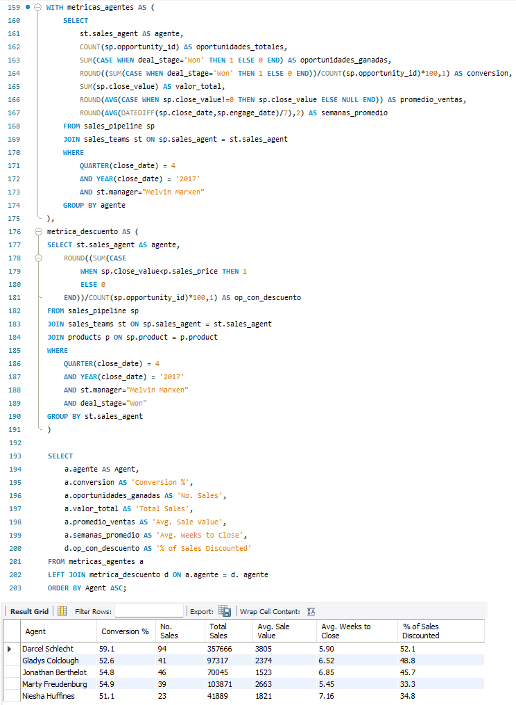
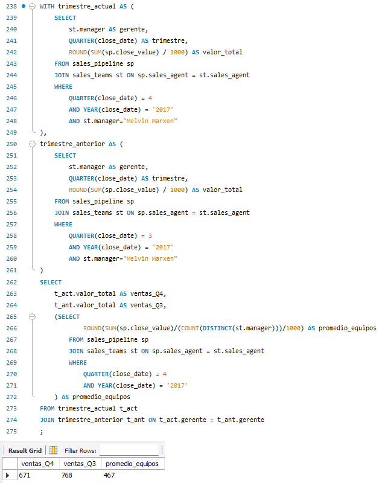
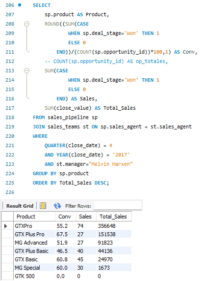

# 📈 Análisis de CRM de Ventas – MavenTech


---

## 💡 Resultados del proyecto

| Métrica | Resultado |
|---|---|
| Preguntas de negocio respondidas | ✅ 11 + 2 bonus |
| Tablas analizadas | ✅ 4 (accounts, products, sales_pipeline, sales_teams) |
| Período analizado | ✅ Q4 2017 (oct–dic) |
| Técnica avanzada aplicada | ✅ CTEs con múltiples subconsultas y comparación entre períodos |
| Conexión a base de datos en la nube | ✅ AWS RDS MySQL |

---

## 🏢 Contexto del negocio

MavenTech es una empresa dedicada a la venta de hardware a grandes compañías. Comenzó a usar un sistema CRM para registrar sus oportunidades de venta, pero no contaba con ninguna herramienta para analizar esa información.

El proyecto simula el rol de Analista de Datos dentro del equipo del **Gerente Melvin Marxen**, respondiendo preguntas clave sobre el rendimiento de sus agentes de ventas durante el Q4 2017. La solución está diseñada con visión gerencial y es escalable a cualquier equipo de la empresa.

---

## 🎯 Preguntas de negocio respondidas

### Rendimiento del equipo (Q4 2017)
1. ¿Cuánto fue el **valor total** de las ventas cerradas?
2. ¿Cuánto fue el **valor promedio** por venta cerrada?
3. ¿Cuánto fue el **tiempo promedio en semanas** para cerrar una oportunidad?
4. ¿Cuántas **nuevas oportunidades** fueron creadas?
5. ¿Cuál es el **valor potencial** de las oportunidades abiertas en estado "Engaging"?

### Desempeño por agente
6. ¿Cuál es la **tasa de conversión** por agente?
7. ¿Cuántas **oportunidades ganadas** tuvo cada agente?
8. ¿Cuál es el **valor total de ventas** por agente?
9. ¿Cuál es el **promedio de ventas** por agente?
10. ¿Cuál es el **promedio de semanas** para cerrar por agente?
11. ¿Qué **% de ventas se realizaron con descuento** por agente?

### Bonus — comparación entre períodos y equipos
- Valor total Q4 vs. Q3 anterior y promedio de todos los equipos
- Valor promedio por venta Q4 vs. Q3 anterior y promedio de todos los equipos

---

## 📸 Resultados destacados

### Tabla de desempeño por agente
*Consolida en una sola query: conversión, ventas ganadas, valor total, promedio y % con descuento*


### Comparación entre trimestres y equipos
*Q4 2017 vs Q3 2017 vs promedio de todos los equipos — en una sola fila usando CTEs*


### Ventas y conversión por producto
*Ranking de productos por valor total de ventas y tasa de conversión*


---

## 📁 Estructura del dataset

| Tabla | Descripción |
|---|---|
| `sales_pipeline` | Registro de oportunidades de venta con fechas, estados y valores |
| `sales_teams` | Agentes de ventas y sus gerentes |
| `products` | Productos ofrecidos con precio de lista |
| `accounts` | Empresas clientes |

**Período:** octubre 2016 – diciembre 2017  
**Asunción del proyecto:** Q4 2017 es el trimestre actual

---

## ⚙️ Técnicas y funciones SQL aplicadas

```sql
-- Funciones de fecha
QUARTER(fecha)
YEAR(fecha)
DATEDIFF(fecha_cierre, fecha_apertura) / 7  -- semanas transcurridas

-- Agregación y filtrado
SUM(), AVG(), COUNT(), ROUND()
GROUP BY, ORDER BY
WHERE con múltiples condiciones

-- Lógica condicional
CASE WHEN deal_stage = 'Won' THEN 1 ELSE 0 END  -- contar ganadas
CASE WHEN close_value < sales_price THEN 1 ELSE 0 END  -- detectar descuentos
CASE WHEN close_value != 0 THEN close_value ELSE NULL END  -- excluir nulos

-- JOINs
JOIN sales_teams ON sales_agent
JOIN products ON product
LEFT JOIN para combinar CTEs

-- CTEs (Common Table Expressions)
WITH metricas_agentes AS (...),
     metrica_descuento AS (...)
SELECT ... FROM metricas_agentes
LEFT JOIN metrica_descuento ON agente

-- Subconsultas en SELECT
(SELECT ROUND(SUM(...)/COUNT(DISTINCT manager)/1000)
 FROM sales_pipeline ...) AS promedio_equipos

-- CROSS JOIN para comparación global
CROSS JOIN all_team_avg
```

---

## 🔍 Decisiones analíticas destacadas

- **Exclusión de valores cero en promedios:** para calcular el valor promedio por venta se excluyeron los registros con `close_value = 0`, ya que representan oportunidades perdidas y distorsionarían el promedio real de ventas cerradas.
- **Detección de descuentos:** se comparó `close_value` con `sales_price` del producto para identificar ventas realizadas por debajo del precio de lista.
- **CTE encadenada:** se consolidaron dos queries independientes en una sola tabla de resultados por agente usando CTEs y `LEFT JOIN`, evitando subconsultas anidadas.
- **Comparación entre períodos:** se usaron múltiples CTEs y una subconsulta en el `SELECT` para obtener en una sola fila el valor del trimestre actual, el anterior y el promedio de todos los equipos.

---

## 🔗 Acceso al proyecto

👉 [Ver código SQL completo](https://drive.google.com/file/d/1oyLvxWoi9wJHJwVlYcMzOLzTid1Si2G1/view?usp=sharing)  
👉 [Ver caso original en Maven Analytics](https://mavenshowcase.com/project/14140)

---

## 👩‍💻 Autora

**María Sofía Nolazco** — Ingeniera Civil | Analista de Datos  
[LinkedIn](https://www.linkedin.com/in/maria-sofia-nolazco-4a69a0134) · [Portfolio](https://sofianolazco.github.io/)
